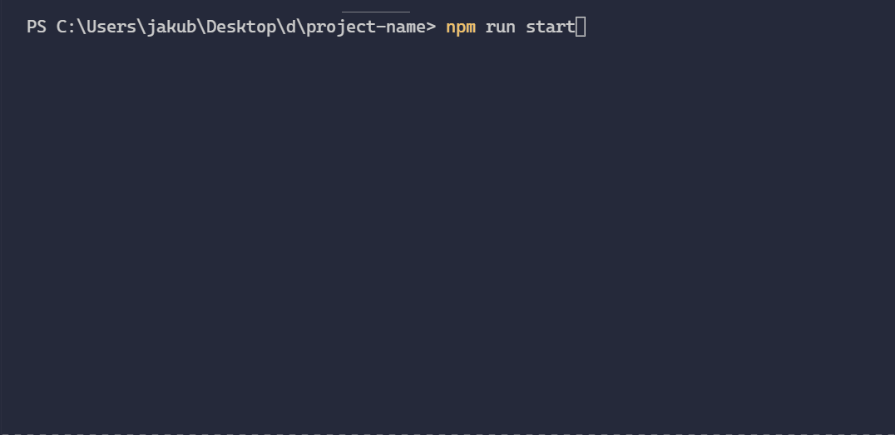
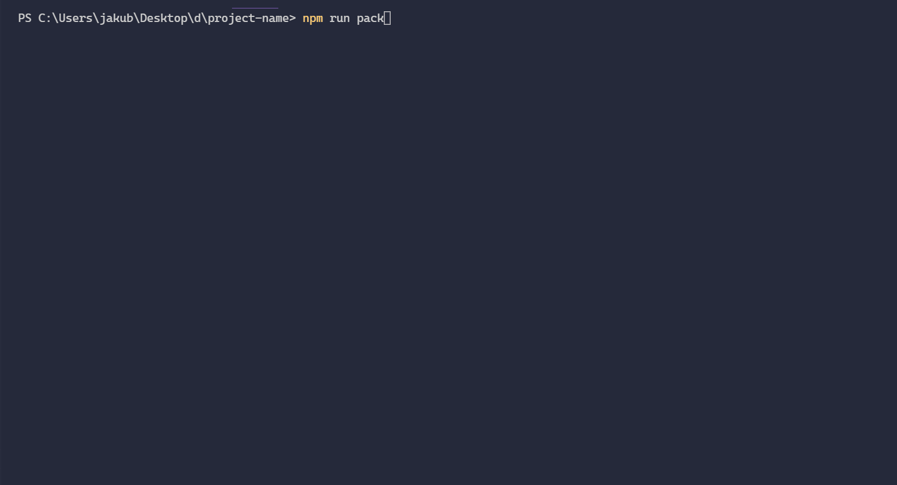

# Getting started

<p align="left">
    
</p>

This section of the documentation addresses the issue of installation and overall setup.

?> **Tip**: To get optimal results and to make sure your newly created `plugin` will be accepted, please follow these instructions **very carefully**

## Process overview

### Here are some steps to follow to create a new plugin <!-- {docsify-ignore} -->

1. Install local developer enviroment :computer:
2. Work your magic and create a plugin locally, with a regard to all the rules :scroll:
3. Prepare to deploy:
   - Run packing command in your IDE of choice
   - Create an account or login into your `developer` account
   - Create a new plugin
     - Give it a unique name
     - Upload your `zipped` code
4. Await admin to review your code :hourglass:
5. After review, your plugin will be deployed and ready to be used in our app :tada:

### Some rules regarding your code <!-- {docsify-ignore} -->

!> _Code that does not respect these rules, will certainly be rejected_

1. Do **NOT** introduce bugs please :bug:
2. Respect user data
3. Do not store **cookie** data or **localstorage** data
4. Do not reach outside your **DOM**
5. Obviously our site is **SFW**, no pornography or explicit content
6. Fetching remote data is fine but do not overdo it
7. At least try to make your plugins aesthetically pleasing :cherry_blossom:
8. No **disk** operations from a **node** enviroment
9. Any **shady** practices will surely be detected. Remember that we are not playing around! :rage:

## Developer account

This is how to create developer account...

?> **Tip**: You can create a developer account using **Github SSO**

## Development enviroment

To build, run and test newly created plugin we use custom template to a `create-react-app` project.

<p align="center">
    
</p>

!> **Important**: Make sure to have installed on your local machine `node` version 12 and `npm` version 6 or `yarn` version 1.22.4. <br/> _Older versions might work but be too unstable_.

### To create new project <!-- {docsify-ignore} -->

<!-- tabs:start -->

#### **npm**

```powershell
npx create-react-app project-name --template collapp
```

#### **yarn**

```powershell
yarn create react-app project-name --template collapp
```

#### **pnpm**

```powershell
pnpx create-react-app project-name --template collapp
```

<!-- tabs:end -->

Since our template allows the usage of `tailwindCSS`, we decided to use **croco** as a replacement for **react-scripts** as it allows custom `postCSS` config.

Generated project structure looks like this. `You should only care of what's in the plugin folder.` The rest is to run your code locally and simulate our site behavoir like, plugin display, resizing and responsiveness.

```
Your project
|-- public
|   |-- index.html
|   `-- favicon.ico
|-- src
|   |-- index.js
|   |-- core
|   |   |-- App.js
|   |   |-- index.css
|   |   `-- pack.js
|   `-- plugin
|       |-- components
|       |   `-- client.jsx
|       |-- logic
|       |   `-- server.js
|       |-- resources
|       |-- styles
|       `-- collapp-config.json
|-- .gitignore
|-- craco.config.js
|-- package.json
|-- tailwindcss.config.js
`-- README.md
```

### To run dev server <!-- {docsify-ignore} -->

Dev server runs on url: <a href="https://localhost:3000/" target=_blank>_https://localhost:3000/_</a>

<!-- tabs:start -->

#### **npm**

```powershell
npm run start
```

#### **yarn**

```powershell
yarn start
```

#### **pnpm**

```powershell
pnpm start
```

<!-- tabs:end -->



### To pack project for review <!-- {docsify-ignore} -->

Keep all your created files inside `plugin` folder. Any import outside that or `node_modules` will not be packed.
Folder structure will be validated at the point of packing. Make sure to have a file called `client.jsx` inside **components** folder and `server.js` inside **logic** folder. These files are entry points to your plugin!

Newly generated file inside `out` folder will be named with a generated _hash code_. **DO NOT RENAME THIS FILE** as it will be used to validate project structure when Admin gets to a review process.

!> **Important** Keep the original name of the generated `zip` file

<!-- tabs:start -->

#### **npm**

```powershell
npm run pack
```

#### **yarn**

```powershell
yarn pack
```

#### **pnpm**

```powershell
pnpm pack
```

<!-- tabs:end -->



## Additional dependencies

<p align="center">
    
</p>

Just install it via npm repository. All installed packeges inside `package.json` will be merged and used on our build server to create production build. **You can NOT directly import scripts from CDN**
